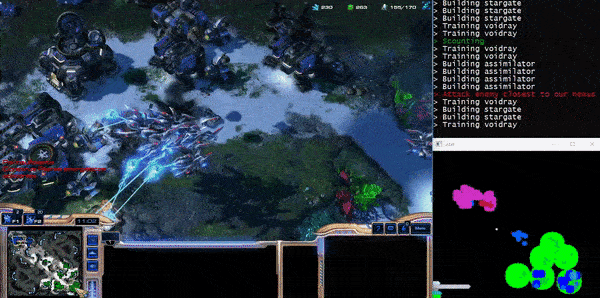

# Convolutional Neural Network on Starcraft II



- Python 3.6
- Windows 10

## [Setup](https://github.com/deepmind/pysc2)

- Install starcraft
- Download some [maps](https://github.com/Blizzard/s2client-proto#map-packs)
- Create the `Maps` folder in your StarCraft installation folder and extract the maps there
- from `/ai-starcraft/stage1/`
```sh
pip install -r requirements.txt
mkdir train_data
mkdir models
```

Collect the data and train a model in a virtual machine (paperspace) with tensorflow-gpu, it'll take a long time

## Run

`stage1` has 4 outputs: no attack, attack closest enemy, attack enemy structure and attack enemy start. 

- `python stage1/get_data.py`: Generate the train data, can download the samples [here](https://drive.google.com/file/d/1cO0BmbUhE2HsUC5ttQrLQC_wLTdCn2-u/view)
- `python stage1/train.py`: Generate the model, or can download a model [here](https://drive.google.com/file/d/10lj3vo3nsEMhJayD-K-JFM8t-3BQYmWV/view)
- `python stage1/evaluate.py`: See the machine taking decisions

---

if u installed starcraft in C: directory, comment this line:
`os.environ["SC2PATH"] = 'E:\Program Files\StarCraft II'`

The [sc2](https://github.com/daniel-kukiela/python-sc2) folder is a fork from the official sc2 [wrapper api](https://github.com/Dentosal/python-sc2) with the custom `on_end` function
